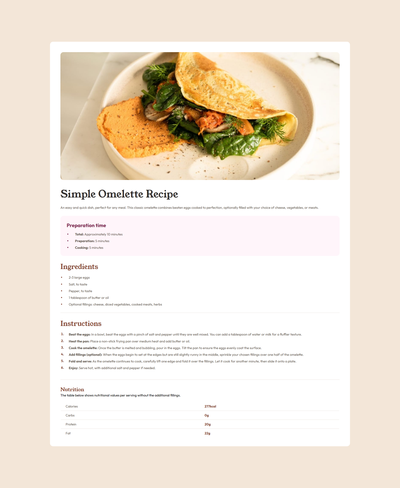

# Frontend Mentor - Recipe page solution

This is a solution to the [Recipe page challenge on Frontend Mentor](https://www.frontendmentor.io/challenges/recipe-page-KiTsR8QQKm). Frontend Mentor challenges help you improve your coding skills by building realistic projects.

## Table of contents

- [Frontend Mentor - Recipe page solution](#frontend-mentor---recipe-page-solution)
  - [Table of contents](#table-of-contents)
  - [Overview](#overview)
    - [Screenshot](#screenshot)
    - [Links](#links)
  - [My process](#my-process)
    - [Built with](#built-with)
    - [What I learned](#what-i-learned)
    - [Continued development](#continued-development)
    - [Useful resources](#useful-resources)
  - [Author](#author)

## Overview

Landing Page about showing the Recipe Page of how to make an Omelette

### Screenshot

### Links

-   Solution URL: [My Solution](https://github.com/hoapooh/fem-recipe-page)
-   Live Site URL: [Hoapooh Recipe Page](https://hoapooh-fem-recipe-page.netlify.app/)

## My process

### Built with

-   Semantic HTML5 markup
-   CSS custom properties
-   CSS Modules
-   CSS Grid
-   [Vite](https://vitejs.dev/) - Next Generation Frontend Tooling
-   [React](https://reactjs.org/) - JS library
-   [Next.js](https://nextjs.org/) - React framework
-   [Styled Components](https://styled-components.com/) - For styles

### What I learned

I leanred some new things that you actually can assign a color to the dot in unordered list and also the ordered list

### Continued development

I will continue adding more responsive for this project in the near future

### Useful resources

-   [Dave Gray Website Courses](https://courses.davegray.codes/) - This person really help me a lot, really appreciate him.
-   [Code With Harry](https://www.codewithharry.com/) - This is an amazing website owned by Code With Harry - he is a famous Youtuber about coding with more than 6 millions subscriber and his knowldge is at another level.
-   [huXn WebDev](https://www.youtube.com/@huxnwebdev/playlists) - This guys also a sigma, he helps me a lot, his teaching style is really amazing and i love it.

## Author

-   Website - [An Phuc Hoa](https://phuc-hoa-porfolio.vercel.app/)
-   Frontend Mentor - [@hoapooh](https://www.frontendmentor.io/profile/hoapooh)
